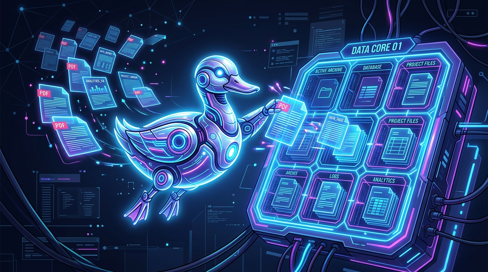

<div align="center">
  
  <h1>🦆 DuckDB KB Agent</h1>
  <p><b>Agentic Knowledge Base & Document Management System</b></p>
  <p>
    
    
    
    
  </p>
</div>

<br/>

## 💡 About

**DuckDB KB Agent** represents a paradigm shift from traditional Markdown-based wikis. Instead of human-maintained documentation, this system is designed to be **operated entirely by an AI Coding Agent** (e.g., Antigravity, Cline).

The agent utilizes specialized Python skills to ingest raw documents (PDF, Word, Excel, HTML), extract **structured elements** (titles, paragraphs, tables) with metadata (page number, section, element type), segment them semantically, and store everything in a **DuckDB database**. It answers user queries using a **hybrid retrieval** system (BM25 Full-Text Search + vector embeddings via Reciprocal Rank Fusion) at the **chunk level**, providing verifiable source citations.

---

## ✨ Key Features

- **Structured Extraction**: Automatically routes and extracts PDF (pdfplumber, tables + page numbers), Word (python-docx, tables + headings), HTML (trafilatura), and Office/Excel documents.
- **Semantic Chunking (Parent-Child)**: Documents are split into structure-aware chunks (using titles as boundaries, preserving tables, ~600-1200 chars). These "Parent" chunks are then subdivided into smaller "Child" chunks (~300 chars) for maximum embedding precision, while the entire Parent chunk is fed to the LLM to retain maximum context.
- **Hybrid Retrieval (Chunk-Level)**: BM25 (exact match) + `bge-m3` embeddings (semantic) fused via Reciprocal Rank Fusion, with per-document diversification. Contexts are injected into the LLM prompt using strict XML tags (`<document><source>...</source><content>...</content></document>`) to prevent hallucinations.
- **Verifiable Citations**: Each result carries page number, section, and element type, enabling the agent to cite its sources accurately.
- **Zero Cloud**: 100% local operation (Ollama for embeddings + LLM, DuckDB for storage/search). No external APIs required.
- **Agent-First Architecture**: A strict `AGENTS.md` manifesto instructs the AI on how to interact with the database using isolated Python scripts (`skills/`).
- **Modern Stack**: Built with Python 3.14, `uv`, Pydantic, and DuckDB (FTS + vss/HNSW).

---

## 🛠️ Prerequisites

- **Python 3.14** and **[uv](https://docs.astral.sh/uv/)**.
- **Ollama** running locally (for embeddings) and/or a remote server for generation. 
  Configuration is handled via a **`.env`** file at the root:
  
  ```env
  # LLM for text generation (chat, summary, RAG)
  KB_LLM_BASE_URL="http://10.201.12.50:8080" # (optional) Leave empty to use local Ollama
  OLLAMA_MODEL="gemma-4-E4B-it-Q4_K_M.gguf"

  # Embedding model for vectorization (local Ollama by default)
  OLLAMA_BASE_URL="http://localhost:11434"
  KB_EMBED_MODEL="bge-m3:latest"
  ```
- **Source Documents**: The user provides the document paths at ingestion (local/network file or folder). No forced `raw/` folder; documents are not versioned (see `.gitignore`).

---

## 🚀 Getting Started

```bash
# 1. Install dependencies
uv sync

# 2. Initialize the DuckDB database (tables + FTS index + HNSW vector index)
uv run skills/init-db/run.py

# 3. Ingest a document
#    (structured extraction + chunking + doc embedding + chunk embeddings + LLM summary)
uv run skills/ingest-doc/run.py "C:\path\to\document.pdf" --category "Tech"

# 4. Hybrid search (FTS + vector, RRF fusion) — default mode
uv run skills/search-db/run.py "keywords" --limit 3
#    isolated modes: --mode fts | vector | hybrid
```

### Bulk Ingestion

```bash
uv run batch_ingest.py "C:\path\to\folder" --category "Operations"
# Filter by extensions:
uv run batch_ingest.py "C:\path\to\folder" --extensions .pdf .docx
```

Deduplication is **smart**: an unmodified document (same content) is skipped, while a modified document (same path, different content) is **updated** (the old version and its chunks are purged and replaced). Use `--force` to force re-ingestion.

### Web Interface (Chat with SSE streaming)

```bash
uv run uvicorn web.app:app --reload
```

### LLM Vision (Images, Embedded Images & Scanned PDFs)

By default, images (scanned PDFs, embedded images in PDFs and DOCX, isolated `.png`/`.jpg` files) are **processed automatically** and sent to a local multimodal model (Gemma 4, already included — no extra model required) which generates a transcription/description indexed as a normal chunk.

```bash
# Standard ingestion with vision active by default
uv run skills/ingest-doc/run.py "C:\path\to\screenshot.png"
uv run skills/ingest-doc/run.py "C:\path\to\scanned_pdf.pdf"

# If you need to disable it to save time, add to the .env file:
# KB_VISION_ENABLED=0
uv run batch_ingest.py "C:\path\to\folder"
```

⚠️ **Cost**: each image takes ~15-30s of VLM processing time. Vision is therefore **opt-out** (enabled by default). If the VLM is unavailable, the image is silently skipped (ingestion does not crash).

Configuration (in the **`.env`** file):
- `KB_VISION_ENABLED=0` — globally disables vision (default: 1)
- `KB_VISION_MODEL` — multimodal model (default: same Gemma 4 used for chat)
- `KB_VISION_DPI` — rasterization resolution for PDF pages (default: 200)
- `KB_VISION_TIMEOUT` — timeout per image in seconds (default: 300)

---

## 🔧 Maintenance

- **Rebuild the FTS index** (after massive ingestions or inconsistent results):
  ```bash
  uv run skills/reindex/run.py
  ```
- **(Re)calculate embeddings** (document and/or chunks) — safe resume:
  ```bash
  uv run skills/embed-docs/run.py                       # docs/chunks without embedding
  uv run skills/embed-docs/run.py --rebuild             # recalculate all
  uv run skills/embed-docs/run.py --chunks-only         # chunk embeddings only
  uv run skills/embed-docs/run.py --filter "file_path ILIKE '%\\folder\\%'"   # subset
  ```
- **Migrate an older database** to the current schema (primary keys, `keywords` as list, `embedding` column + HNSW index, **`chunks` table** + FTS/HNSW index):
  ```bash
  uv run skills/migrate-db/run.py            # dry-run (read only)
  uv run skills/migrate-db/run.py --apply    # execute (automatic backup)
  ```
- **Reindex with vision** (make screenshots/images searchable) — see [`docs/REINDEXATION-VISION.md`](docs/REINDEXATION-VISION.md) for detailed procedure:
  ```bash
  uv run skills/reindex-vision/run.py --limit 3                                  # quick test
  uv run skills/reindex-vision/run.py --filter "file_path ILIKE '%.docx'"        # DOCX only
  ```

---

## 🧪 Testing

```bash
uv run pytest                      # unit tests (temporary db, mock LLM/embedding)
uv run pytest -m integration       # + integration tests (requires knowledge.duckdb)
```

### 💡 Headroom Experimentation (Strategic Rejection)
An integration of the **Headroom** SDK was tested and benchmarked (`bench/run_bench_headroom.py`) to compress the RAG context input for the LLM. 
**Result:** Although compression can reach up to 90% token savings without degrading response quality (with strict prompt and `target_ratio=0.5`), the latency cost (~+3 seconds per query to load the ML Kompress model locally) outweighs the benefits for a **100% local** (Zero Cloud) architecture.
**Decision:** Headroom was removed from the project as local input tokens (Ollama) have no direct financial cost, and response speed (UX) is the priority. Code and dependencies were purged to keep the project lightweight.

---

## 🧱 Database Schema

```text
documents              id (SHA-256 hash of content) PK, file_name, file_path, category, indexed_at
document_content       document_id PK (1:1), raw_text (full text), embedding FLOAT[1024]
document_ai_metadata   document_id PK (1:1), summary (LLM), keywords VARCHAR[]
chunks                 id PK, document_id FK, chunk_index, text, parent_text TEXT,
                       element_type, page_number, section, embedding FLOAT[1024]
```

Indexes: FTS (BM25) on `document_content.raw_text` and `chunks.text`; HNSW (cosine) on `document_content.embedding` and `chunks.embedding`.

---

## 📂 Architecture

```text
duckdb-kb-agent/
├── AGENTS.md               # AI Agent directives
├── kb.py                   # Shared lib (DuckDB connection, embeddings, hybrid search, get_chunk_id)
├── parsing.py              # Structured extraction (PDF/DOCX/HTML/XLSX/txt) + semantic chunking
├── vision.py               # LLM Vision (OCR/image description via multimodal Gemma 4)
├── pyproject.toml          # Dependencies (uv)
├── knowledge.duckdb        # DuckDB database (generated, not versioned)
├── batch_ingest.py         # Mass ingestion (from a provided path)
├── skills/                 # Agent tools
│   ├── init-db/            # DB creation + tables + FTS index + HNSW vector index
│   ├── ingest-doc/         # Extraction + chunking + insertion + embeddings (Ollama)
│   ├── embed-docs/         # Massive embedding backfill (doc + chunks)
│   ├── search-db/          # Chunk-level hybrid search (FTS + vector, RRF fusion)
│   ├── reindex/            # FTS index reconstruction
│   ├── reindex-vision/     # Reindex with LLM vision (screenshots, scanned PDFs)
│   └── migrate-db/         # Schema migration (non-destructive)
├── bench/                  # RAG Benchmark (questions, run, comparative)
├── docs/                   # Documentation (Unstructured audit, vision reindexing)
├── tests/                  # Pytest suite
└── web/                    # FastAPI interface (chat)
```
